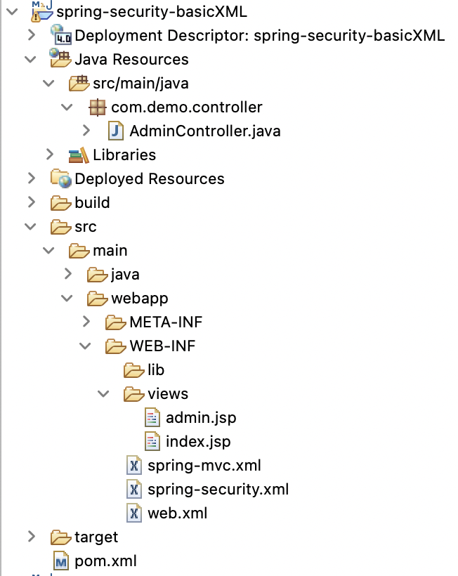
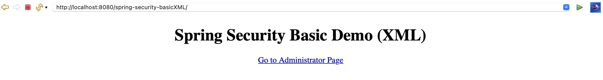
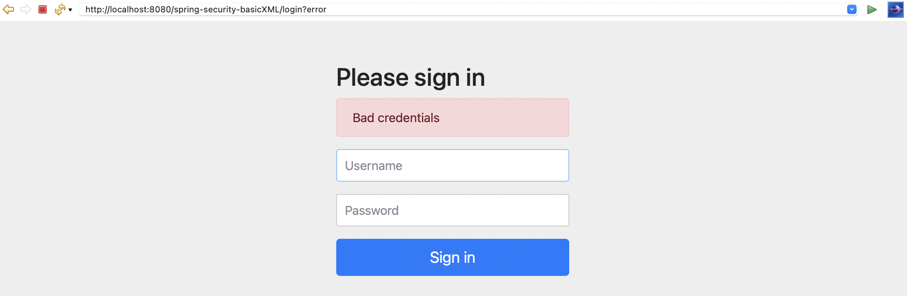
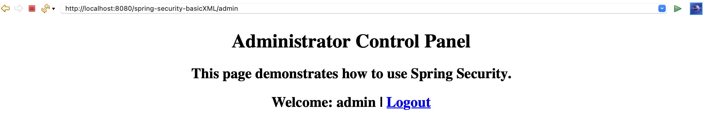
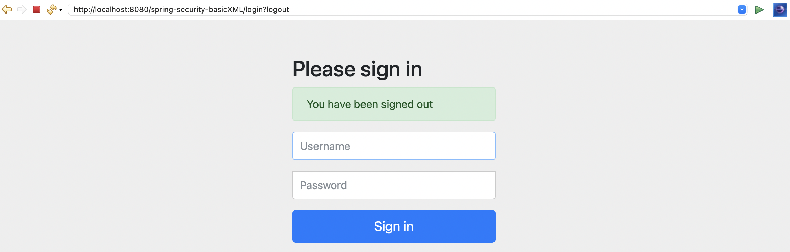

# spring-security-xml

This is a **Java Web Application** and integrate `Spring MVC` + `Spring Security` with `XML Configuration`.

## Tools and Technologies Used

-   Java 8
-   Tomcat 9 with Servlet 4.0
-   Spring framework 5.1.4.RELEASE
-   Spring Security 5.1.4.RELEASE.
-   Maven 3.9
-   Spring Tool Suite4 (STS)
-   JSTL 1.2

## About the Application
- It is a Simple **Spring Security example** to demonstrate **XML configuration** and uses **default security login page** given by **Spring Security**
- The sample data of user & role is configured within the `spring-security.xml` file. This file is for authentication & authorization processing. All URL patterns `/admin**` are secured, and only the users having role `ROLE_ADMIN` can be authorized to access these URLs.
- The security filter is declared within `web.xml`

## Project Structure: Spring MVC 5 + Security + XML + In-Memory

## DEMO
### 1. Welcome Page

### 2. Login with Bad Credentials

### 3. Successfully logged in

### 4. Successfully logged out

